# 星巴克数据分析项目

## 项目简介

理解顾客购买行为，对以提供产品和服务为主要盈利目的大多数企业都是至关重要的。通过对顾客购买行为的分析，可以帮助企业提供更好的产品和服务，进而获取更多的市场竞争优势。那么如何更好的理解顾客的购买行为，一种有效的方式是通过对顾客消费记录进行数据挖掘，使用机器学习的手段，来**发现**数据背后隐藏的信息。

## 背景

原始数据是Udacity数据科学家项目提供的。Udacity提供的一些模拟 Starbucks rewards 移动 app 上用户行为的数据。这个数据集是从星巴克 app 的真实数据简化而来。此模拟器仅产生了一种饮品，实际上星巴克的饮品有几十种。一般情况下, 每隔几天, 星巴克会向 app 的用户发送一些推送。

## 数据信息

1. 推送信息，可能仅仅是一条饮品的广告或者是折扣券或 BOGO（买一送一）。一些顾客可能一连几周都收不到任何推送。每种推送都有有效期。例如，买一送一（BOGO）优惠券推送的有效期可能只有 5 天。你会发现数据集中即使是一些消息型的推送都有有效期，哪怕这些推送仅仅是饮品的广告，例如，如果一条消息型推送的有效期是 7 天，你可以认为是该顾客在这 7 天都可能受到这条推送的影响。
2. 交易信息，数据集中还包含 app 上支付的交易信息，交易信息包括购买时间和购买支付的金额。交易信息还包括该顾客收到的推送种类和数量以及看了该推送的时间。顾客做出了购买行为也会产生一条记录。
3. 备注信息，这个数据集里有一些地方需要注意。即，这个推送是自动生效的；顾客收到推送后，即使没有看到，满足了条件，推送的优惠依然能够生效。比如，一个顾客收到了"满10美元减2美元优惠券"的推送，但是该用户在 10 天有效期内从来没有打开看到过它。该顾客在 10 天内累计消费了 15 美元。数据集也会记录他满足了推送的要求，然而，这个顾客并没被受到这个推送的影响，因为他并不知道它的存在。另外，有可能顾客购买了商品，但没有收到或者没有看推送。例如，一个顾客在周一收到了满 10 美元减 2 美元的优惠券推送。这个推送的有效期从收到日算起一共 10 天。如果该顾客在有效日期内的消费累计达到了 10 美元，该顾客就满足了该推送的要求。

## 项目目标

如何更有效地向特定目标客户发送推送信息。顾客聚类，每一类的顾客有何种特征。进而判断哪一类人群会受到何种推送的影响。分析某类人群即使没有收到推送，也会购买的情况。从商业角度出发，如果顾客无论是否收到推送都打算花10美元，我们并不希望给他发送满10美元减2美元的优惠券推送。

## 项目工作流

1. 数据清洗
2. 数据汇总
3. 特征抽取
4. 特征工程
5. 机器学习建模

## 数据基本信息

一共有三个数据文件：

* portfolio.json – 包括推送的 id 和每个推送的元数据（持续时间、种类等等）
* profile.json – 每个顾客的人口统计数据
* transcript.json – 交易、收到的推送、查看的推送和完成的推送的记录

以下是文件中每个变量的类型和解释 ：

**portfolio.json**
* id (string) – 推送的id
* offer_type (string) – 推送的种类，例如 BOGO、打折（discount）、信息（informational）
* difficulty (int) – 满足推送的要求所需的最少花费
* reward (int) – 满足推送的要求后给与的优惠
* duration (int) – 推送持续的时间，单位是天
* channels (字符串列表)

**profile.json**
* age (int) – 顾客的年龄 
* became_member_on (int) – 该顾客第一次注册app的时间
* gender (str) – 顾客的性别（注意除了表示男性的 M 和表示女性的 F 之外，还有表示其他的 O）
* id (str) – 顾客id
* income (float) – 顾客的收入

**transcript.json**
* event (str) – 记录的描述（比如交易记录、推送已收到、推送已阅）
* person (str) – 顾客id
* time (int) – 单位是小时，测试开始时计时。该数据从时间点 t=0 开始
* value - (dict of strings) – 推送的id 或者交易的数额

## 数据预处理

### 数据清洗与特征提取

1. 发现缺失数据

顾客统计数据中有2175个数据，收入和性别的数值缺失，同时年龄数据是118，一样不确定。

2. 删除缺失数据：*数据清洗/预处理步骤1*

鉴于主要分析目的是，聚类目标客户群，缺失的数据没有意义，作删除处理。处理后的有效顾客数14825个。

3. 处理会员天数：*数据清洗/预处理步骤2*

原始数据是顾客第一次注册app的时间，这里通过python datetime处理成到该顾客到2019年12月31号时为至的天数。

4. 处理顾客交易信息：*数据清洗/预处理步骤3-12*

    a) 根据**transcript**数据集里的**value**字段(推送的id 或者交易的数额)，扩展出3个字段：*数据清洗/预处理步骤3*

    * offer_id, 顾客收到的推送id
    * amount, 交易的数额/顾客的消费金额
    * reward, 交易的奖励

    b) 根据offer_id的信息可以聚合交易信息和推送信息（transcript，portfolio），以此为基础，再聚合已经删除了缺失数据的顾客信息（inner join的方式）这样可以排除交易信息里面的那些缺失性别和年龄的顾客的交易信息。处理后的有效交易信息272762行。*数据清洗/预处理步骤5*

    c) 为了便于处理10种不同的推送，为每个推送创建新的命名。

    |命名|说明|
    |---|---|
    |`bogo_1`|买一送一1, 有效期为7天的消费10奖励10|
    |`bogo_2`|买一送一2, 有效期为5天的消费10奖励10|
    |`bogo_3`|买一送一3, 有效期为7天的消费5奖励5|
    |`bogo_4`|买一送一4, 有效期为5天的消费5奖励5| 
    |`discount_1`|折扣1, 有效期为10天的消费20奖励5|
    |`discount_2`|折扣2, 有效期为7天的消费7奖励3|
    |`discount_3`|折扣3, 有效期为10天的消费10奖励2|
    |`discount_4`|折扣4, 有效期为7天的消费10奖励2|
    |`informational_1`|信息1, 有效期4天无奖励|
    |`informational_2`|信息2, 有效期3天无奖励|
    
    d) 分别根据**推送名称**，**推送类型**和**推送的3种状态**，处理每个顾客的交易信息，并且加入新的字段保存汇总的信息。汇总后特征如下：*数据清洗/预处理步骤6-8*
    
    | Feature name | Description | 
    |---|---|
    |`amount                          `    |消费总计|
    |`reward_x                        `    |消费后获得的奖励|
    |`offer completed                 `    |推送完成总计|
    |`offer received                  `    |收到推送总计|
    |`offer viewed                    `    |查看推送总计|
    |`transaction                      `   |交易总计|
    |`bogo_received                    `   |收到所有4种买一送一总计|
    |`bogo_viewed                      `   |查看所有4种买一送一总计|
    |`bogo_completed                   `   |完成所有4种买一送一总计|
    |`bogo_1_received                  `   |收到买一送一1总计|
    |`bogo_1_viewed                    `   |查看买一送一1总计|
    |`bogo_1_completed                 `   |完成买一送一1总计|
    |`bogo_2_received                  `   |收到买一送一2总计|
    |`bogo_2_viewed                    `   |查看买一送一2总计|
    |`bogo_2_completed                 `   |完成买一送一2总计|
    |`bogo_3_received                  `   |收到买一送一3总计|
    |`bogo_3_viewed                    `   |查看买一送一3总计|
    |`bogo_3_completed                 `   |完成买一送一3总计|
    |`bogo_4_received                  `   |收到买一送一4总计|
    |`bogo_4_viewed                    `   |查看买一送一4总计|
    |`bogo_4_completed                 `   |完成买一送一4总计|
    |`discount_received                `   |收到所有4种折扣总计|
    |`discount_viewed                  `   |查看所有4种折扣总计|
    |`discount_completed               `   |完成所有4种折扣总计|
    |`discount_1_received              `   |收到折扣1总计|
    |`discount_1_viewed                `   |查看折扣1总计|
    |`discount_1_completed             `   |完成折扣1总计|
    |`discount_2_received              `   |收到折扣2总计|
    |`discount_2_viewed                `   |查看折扣2总计|
    |`discount_2_completed             `   |完成折扣2总计|
    |`discount_3_received              `   |收到折扣3总计|
    |`discount_3_viewed                `   |查看折扣3总计|
    |`discount_3_completed             `   |完成折扣3总计|
    |`discount_4_received              `   |收到折扣4总计|
    |`discount_4_viewed                `   |查看折扣4总计|
    |`discount_4_completed             `   |完成折扣4总计|
    |`informational_received           `   |收到所有2种信息推送总计|
    |`informational_viewed             `   |查看所有2种信息推送总计|
    |`informational_1_received         `   |收到信息推送1总计|
    |`informational_1_viewed           `   |查看信息推送1总计|
    |`informational_2_received         `   |收到信息推送2总计|
    |`informational_2_viewed           `   |查看信息推送2总计|

    
    e）在数据汇总的基础上提取特征如下：*数据清洗/预处理步骤9-12*
    
    | Feature name | Description | 
    |---|---|
    |`transaction_completed_ratio      `   |交易次数与推送完成比|
    |`offer_viewed_rate                `   |查看推送与收到推送比|
    |`offer_completed_received_rate    `   |完成推送与收到推送比|
    |`offer_completed_viewed_rate      `   |完成推送与查看推送比|
    |`bogo_viewed_rate                 `   |所有买一送一查看与收到比|
    |`bogo_completed_received_rate     `   |所有买一送一完成与收到比|
    |`bogo_completed_viewed_rate       `   |所有买一送一完成与查看比|
    |`discount_viewed_rate             `   |所有折扣查看与收到比|
    |`discount_completed_received_rate`   |所有折扣完成与收到比|
    |`discount_completed_viewed_rate  `   |所有折扣完成与查看比|
    |`informational_viewed_rate       `   |信息查看与收到比|

5. 离群值分析， *remove outlier的步骤中完成*

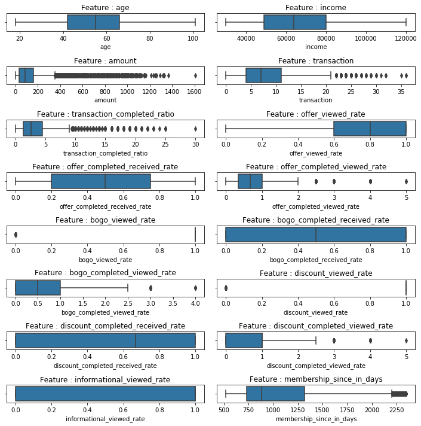

6. 数值标准化， *feature scaling的步骤中完成*
    * 消除量纲，统一标准

### 数据分析

数据一般的统计学分析：

年龄分布:

1. 顾客平均年龄54岁，中位数是55岁，最小18岁，最大101岁，标准差17.38。
2. 其中男性顾客平均年龄52岁，中位数是52岁，最小18岁，最大100岁，标准差17.41。
3. 其中女性顾客平均年龄57岁，中位数是58岁，最小18岁，最大101岁，标准差16.88。

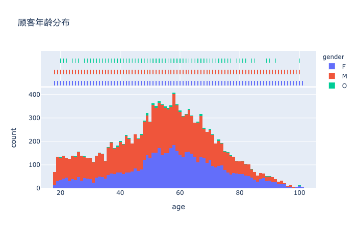

性别分布:

所有顾客中，57.2%是男性， 41.3%是女性， 其他是1.43%

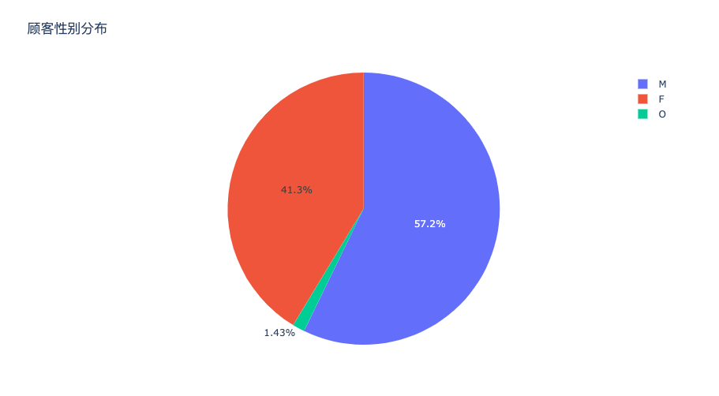

10种推送概览：

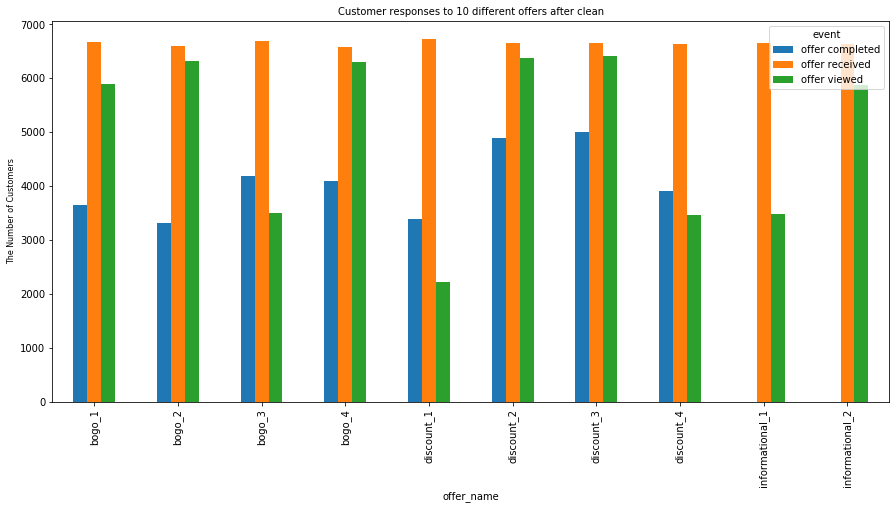

年龄和消费水平的关系(男性):

1. 男性顾客随着年龄的增加，对于平均完成推送一定的正向线性关系。

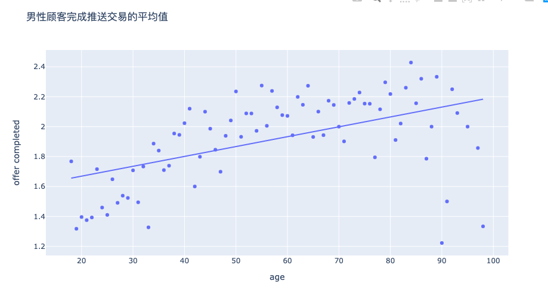

2. 男性顾客随着年龄的增加，对于平均购买交易次数有负向的线性关系，但是对于平均购买量有正向线性关系。

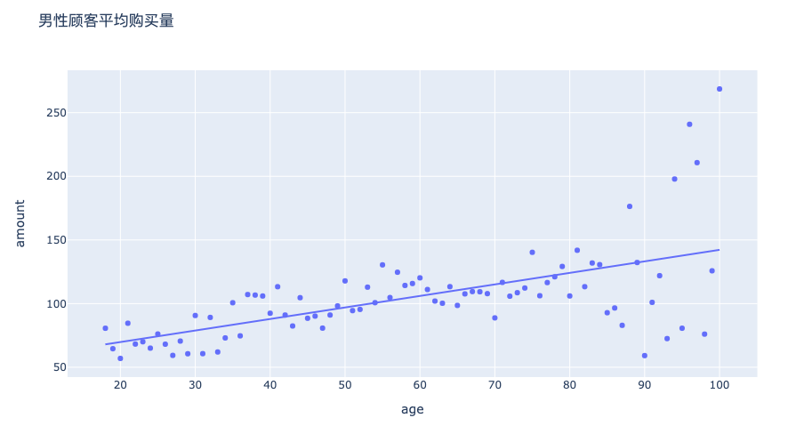
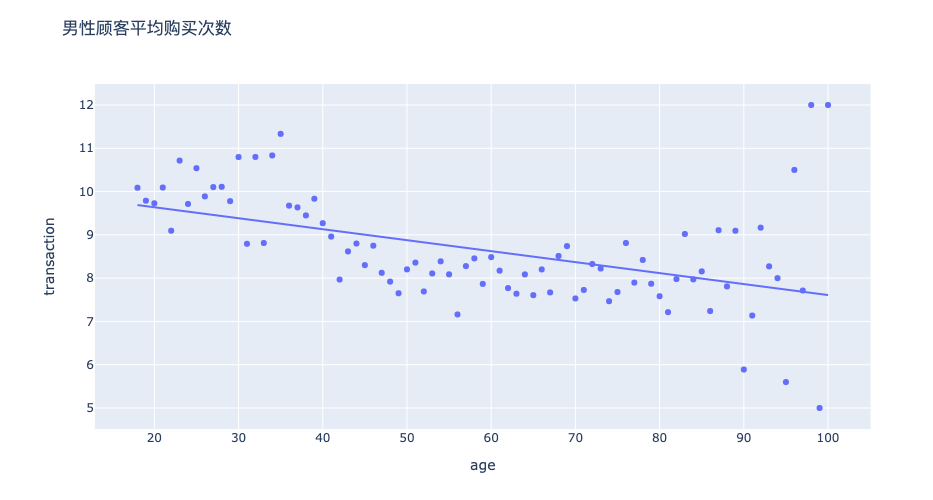

年龄和消费水平的关系(女性):

1. 女性顾客随着年龄的增加，对于平均完成推送相关性不明显。

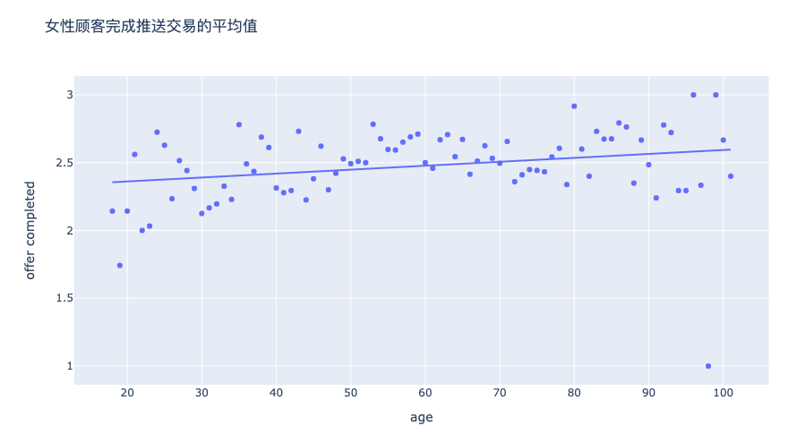

2. 女性顾客随着年龄的增加，对于平均购买交易次数有负相关的趋势，但是60岁以后持平。

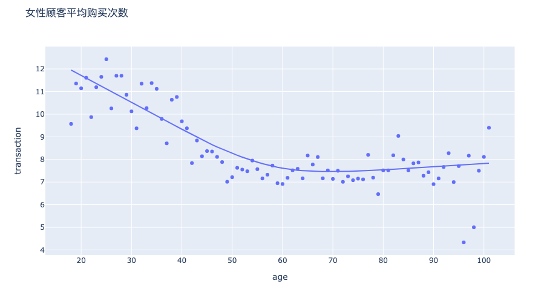

3. 女性顾客随着年龄的增加，对于平均购买量是随年龄增加而增加, 但是70岁以后有下降的趋势。

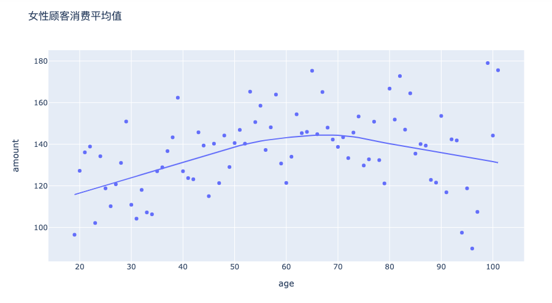
 
收入水平和消费的关系：

* 收入低于50k以下的男顾客和女顾客在消费量，完成推送交易，购买次数上有显著性。说明这两个组购买行为有明显的不同。

     |特征|t-score|p-value|
     |---|---|---|
     |`消费量`|10.7606|0.0|
     |`完成推送交易`|11.4290|0.0|
     |`购买次数`|4.2466|1.1115282947171679e-05|

* 收入在50k和75k之间的男顾客和女顾客在消费量，完成推送交易上有显著性。在消费次数上没有显著性。说明此二组在购买次数上相当，在购买量和完成推送上行为不一样。

     |特征|t-score|p-value|
     |---|---|---|
     |`消费量`|12.7067|0.0|
     |`完成推送交易`|14.2658|0.0|
     |`购买次数`|-0.1511|0.56|

* 收入高于75k的男顾客和女顾客在消费量，完成推送交易，在消费次数上都没有显著性。说明此二组购买行为有一定的类似性。

     |特征|t-score|p-value|
     |---|---|---|
     |`消费量`|-0.4629|0.68|
     |`完成推送交易`|0.8434|0.20|
     |`购买次数`|-0.6398|0.74|

* 收入低于50k的顾客和收入在50k和75k之间顾客在消费量，完成推送交易，存在显著性。在消费次数上都没有显著性。说明此二组在购买次数上类似，但在花费和完成推送交易上不同。

    |特征|t-score|p-value|
    |---|---|---|
    |`消费量`|22.0496|0.0|
    |`完成推送交易`|17.9547|0.0|
    |`购买次数`|-11.1395|1.0|

* 收入低于50k的顾客和收入高于75k的顾客在消费量，完成推送交易，存在显著性。在消费次数上都没有显著性。说明此二组在购买次数上类似，但在花费和完成推送交易上不同。

    |特征|t-score|p-value|
    |---|---|---|
    |`消费量`|38.0860|0.0|
    |`完成推送交易`|34.3149|0.0|
    |`购买次数`|-35.4485|1.0|

* 收入在50k和75k之间顾客和收入高于75k的顾客在消费量，完成推送交易，不存在显著性。在消费次数上有显著性。说明此二组在购买次数上不同，但在花费和完成推送交易上类似。

    |特征|t-score|p-value|
    |---|---|---|
    |`消费量`|-21.9972|1.0|
    |`完成推送交易`|-19.2598|1.0|
    |`购买次数`|29.7061|0.0|

## 特征抽取

通过对顾客一遍信息的统计学分析，不能充分对顾客进行有效对分类，有必要进行特征提取。通过*数据清洗/预处理步骤1-12*后，获取的全部特征如下：

| Feature name | Description | 
|---|---|
|`age`                                 |年龄|
|`income`                              |收入|
|`membership_since_in_days`            |会员天数|
|`amount                          `    |消费总计|
|`reward_x                        `    |消费后获得的奖励|
|`offer completed                 `    |推送完成总计|
|`offer received                  `    |收到推送总计|
|`offer viewed                    `    |查看推送总计|
|`transaction                      `   |交易总计|
|`bogo_1_received                  `   |收到买一送一1总计|
|`bogo_1_viewed                    `   |查看买一送一1总计|
|`bogo_1_completed                 `   |完成买一送一1总计|
|`bogo_2_received                  `   |收到买一送一2总计|
|`bogo_2_viewed                    `   |查看买一送一2总计|
|`bogo_2_completed                 `   |完成买一送一2总计|
|`bogo_3_received                  `   |收到买一送一3总计|
|`bogo_3_viewed                    `   |查看买一送一3总计|
|`bogo_3_completed                 `   |完成买一送一3总计|
|`bogo_4_received                  `   |收到买一送一4总计|
|`bogo_4_viewed                    `   |查看买一送一4总计|
|`bogo_4_completed                 `   |完成买一送一4总计|
|`bogo_received                    `   |收到所有4种买一送一总计|
|`bogo_viewed                      `   |查看所有4种买一送一总计|
|`bogo_completed                   `   |完成所有4种买一送一总计|
|`discount_1_received              `   |收到折扣1总计|
|`discount_1_viewed                `   |查看折扣1总计|
|`discount_1_completed             `   |完成折扣1总计|
|`discount_2_received              `   |收到折扣2总计|
|`discount_2_viewed                `   |查看折扣2总计|
|`discount_2_completed             `   |完成折扣2总计|
|`discount_3_received              `   |收到折扣3总计|
|`discount_3_viewed                `   |查看折扣3总计|
|`discount_3_completed             `   |完成折扣3总计|
|`discount_4_received              `   |收到折扣4总计|
|`discount_4_viewed                `   |查看折扣4总计|
|`discount_4_completed             `   |完成折扣4总计|
|`discount_received                `   |收到所有4种折扣总计|
|`discount_viewed                  `   |查看所有4种折扣总计|
|`discount_completed               `   |完成所有4种折扣总计|
|`informational_1_received         `   |收到信息推送1总计|
|`informational_1_viewed           `   |查看信息推送1总计|
|`informational_2_received         `   |收到信息推送2总计|
|`informational_2_viewed           `   |查看信息推送2总计|
|`informational_received           `   |收到所有2种信息推送总计|
|`informational_viewed             `   |查看所有2种信息推送总计|
|`transaction_completed_ratio      `   |交易次数与推送完成比|
|`offer_viewed_rate                `   |查看推送与收到推送比|
|`offer_completed_received_rate    `   |完成推送与收到推送比|
|`offer_completed_viewed_rate      `   |完成推送与查看推送比|
|`bogo_viewed_rate                 `   |所有买一送一查看与收到比|
|`bogo_completed_received_rate     `   |所有买一送一完成与收到比|
|`bogo_completed_viewed_rate       `   |所有买一送一完成与查看比|
|`discount_viewed_rate             `   |所有折扣查看与收到比|
|`discount_completed_received_rate`   |所有折扣完成与收到比|
|`discount_completed_viewed_rate  `   |所有折扣完成与查看比|
|`informational_viewed_rate       `   |信息查看与收到比|
|`F                               `   |女性one-hot|
|`M                               `   |男性one-hot|
|`O                               `   |性别其他|

查看主要特征的分布：

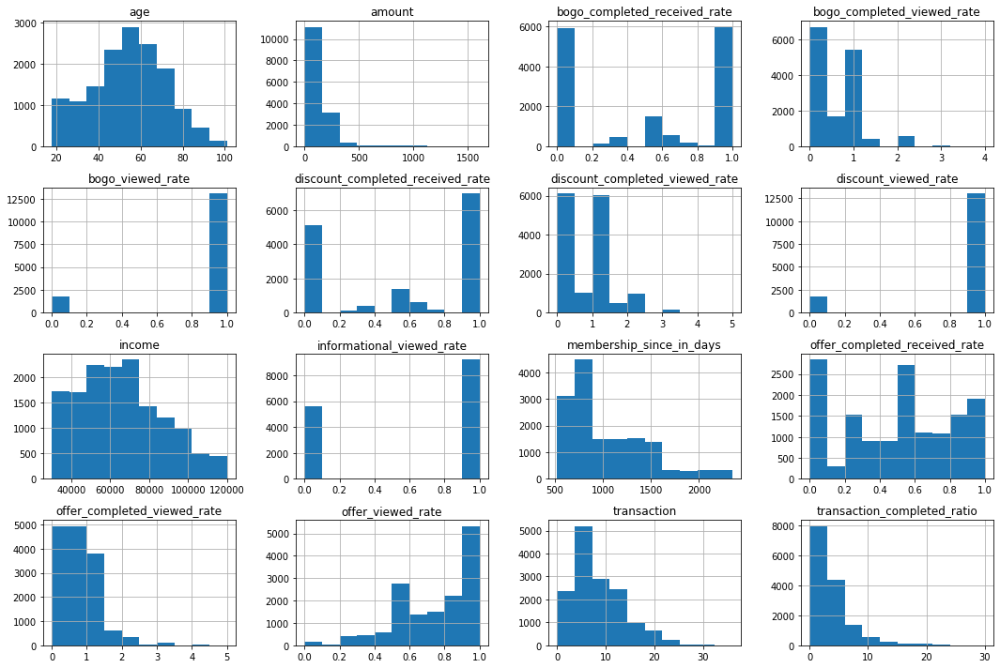

查看主要特征的关联关系：

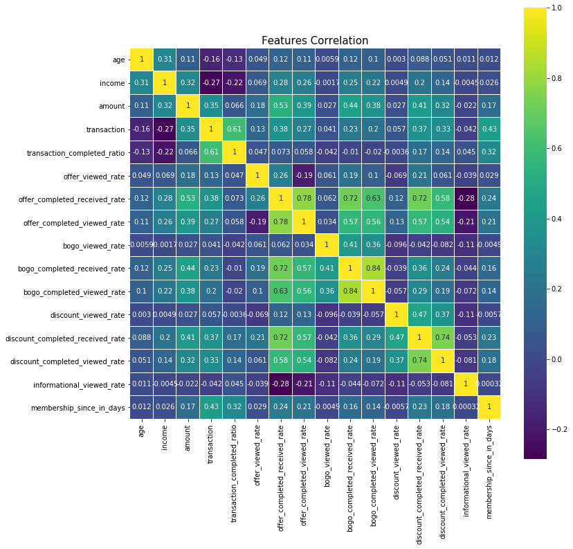

## 机器学习建模

### 模型性能评价指标

无监督学习-对于聚类算法而言，希望同一簇的样本尽量相似，不同簇的样本差异越大越好，一般常见的就是衡量：
    
* 簇内相似性：越相似越好
* 簇间差异性：越不同越好
    
好的聚类应该同时满足有高的簇内相似性和高的簇间差异性。指标Inertia度量所有簇内样本与其簇中心的距离。如果其值越低，说明簇内样本越相似。指标Silhouette数值度量簇内样本，与簇间样本相比的紧密程度，同时兼顾了簇内和簇间的度量，数值越大越好。他们结合评价聚类算法的结果是比较可行的。

监督学习-对于预测连续型变量的回归模型，有评价指标R^2。R^2(R-squared)在统计学中用于度量因变量的变异中可由自变量解释部分所占的比例，以此来判断统计模型的解释力。R^2的值取值范围，小于1的实数。如果一个模型R^2值是0意味着自变量可以通过此模型刚刚好可以预测因变量的均值, 如果R^2的值是1说明通过模型可以很好的预测因变量，如果值在0和1之间， 说明有多少百分比的部分可以由通过模型解释因变量的变异度. 

### PCA降维

通过PCA帮助理解数据：

前30个PCA Components可以解释原始数据97%的变异数

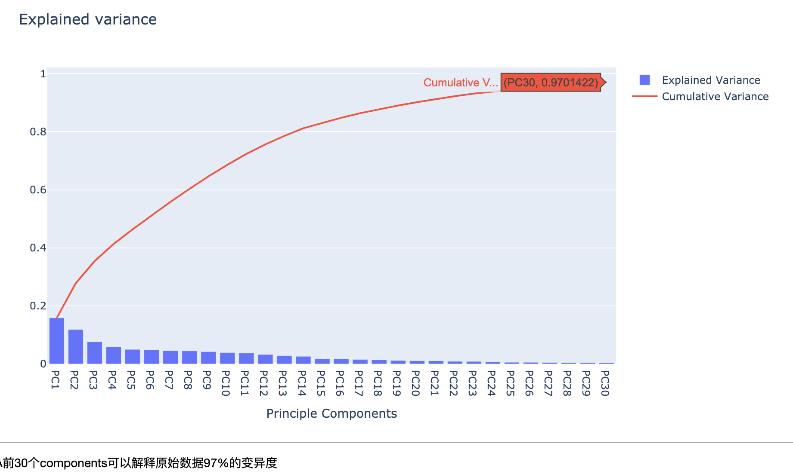

#### 前3个PCA Components的特征权重

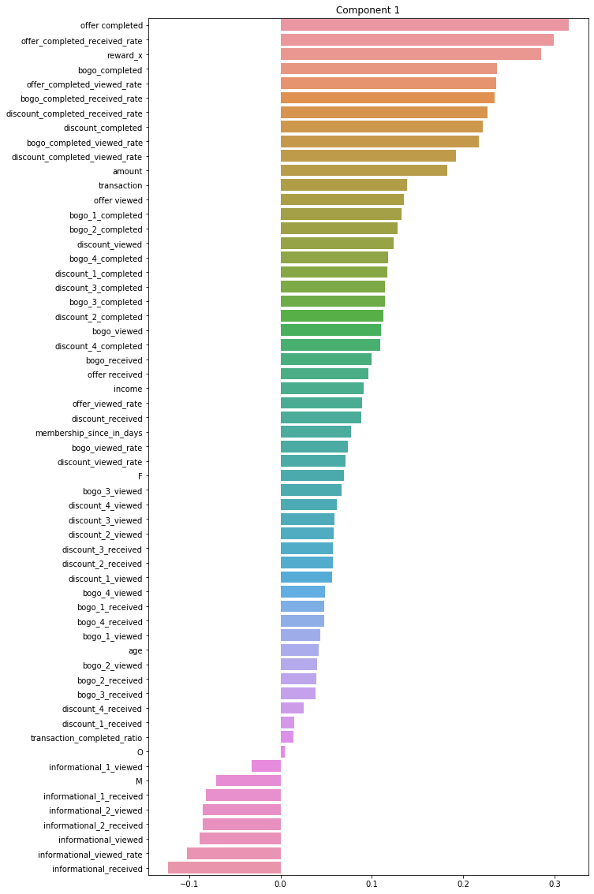
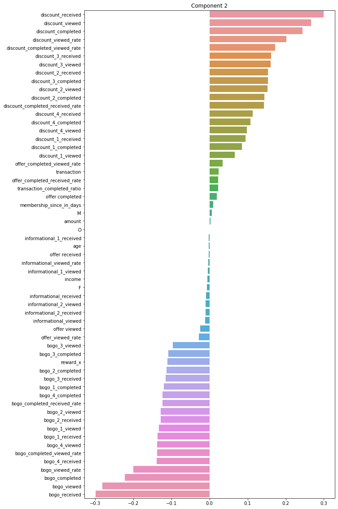
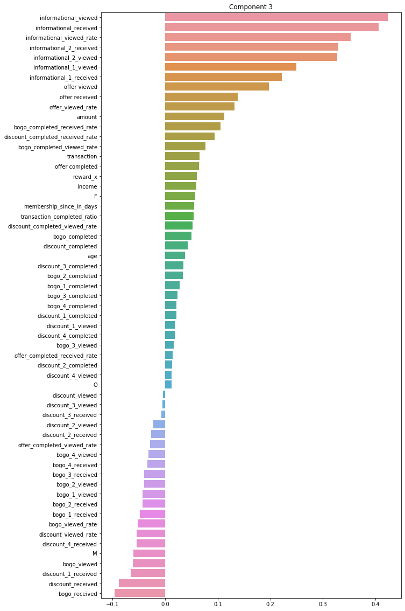

### 无监督学习 - KMeans Clustering

#### Sihouette分数

Silhouette数值度量组内样本，与组间样本相比的紧密程度。It is calculated using the mean intra-cluster distance (a) and the mean nearest-cluster distance (b) for each sample. The Silhouette Coefficient for a sample is (b - a) / max(a, b). 值越大越好。

#### Inertia指标

Inertia度量所有组内样本与组中心的距离。
Inertia calculates the sum of distances of all the points within a cluster from the centroid of that cluster. 值越小越好。

#### 如何决定K值

如图所示，通过计算不同K-Means聚类的Sihouette分数和Inertia指标，K=13比较理想。
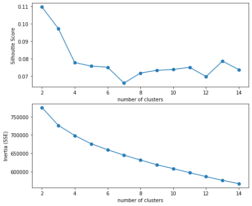

#### 聚类结果

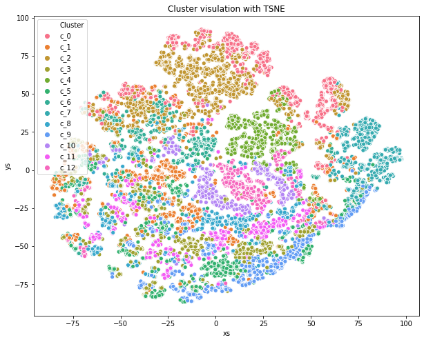

### 监督学习 - 预测推送完成比率

监督学习建模：

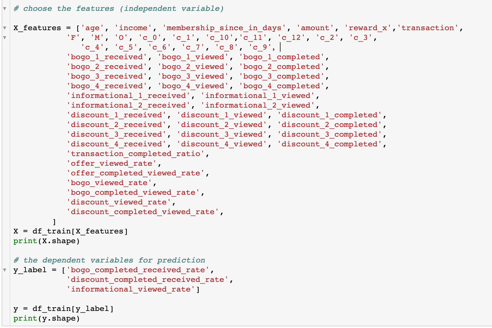

|Model|Performance|
|---|---|
|`Random Forest`|R^2 0.9927, MSE 0.007258|
|`Neural Network`|R^2 0.9998, MSE 0.000181|

通过R^2的指标说明现有的特征通过模型可以很好的解释预测变量。但可能有过拟合的发生。

## 发现与结论

顾客聚类分析结果：

一般情况：

1. 各个群组的平均年龄比较接近。
2. 群组9平均消费水平和收到的奖励都是最高的一组。
3. 各个群组的平均收入水平也相对接近，群组0，2，6平均收入相对比较低， 群组6的平均收入相对最低。
4. 群组0，2平均消费水平和收到奖励都是最低的两组。

5. 各个群组的平均会员时间比较接近， 群组6相对较长。
6. 群组0，2，6男性顾客比女性顾客多。群组6的男性顾客为80%，女性为20%。其他组的男性和女性顾客比率比较接近。

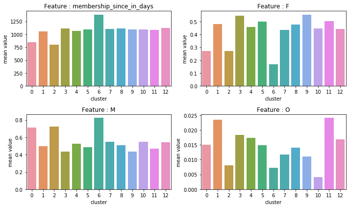

对各种推送：
1. 各个群组收到的各种推送总体而言比较接近。
2. 群组9是推送完成和平均消费最高的一组。
3. 群组0，2完成推送和平均消费都是最低组。

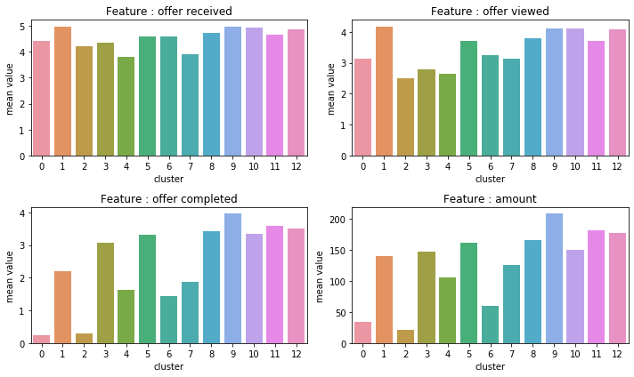

折扣1：
1. 群组7几乎没有收到折扣1的推送。
2. 群组11接收，查看和完成折扣1推送比较高。

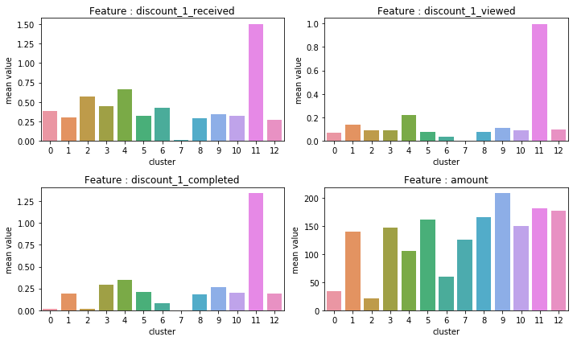

折扣2:
1. 群组7几乎没有收到折扣2推送。
2. 群组10接收，查看和完成折扣2推送比较高。
3. 群组0，2，完成折扣2推送比较低。

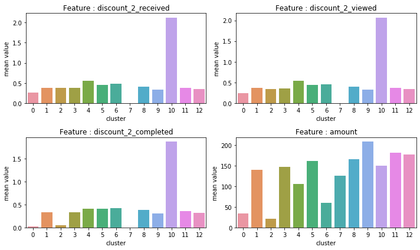

折扣3:
1. 群组7几乎没有收到此种折扣3推送。
2. 群组12接收，查看和完成折扣3推送比较高。
3. 群组0，2，完成折扣3推送比较低。

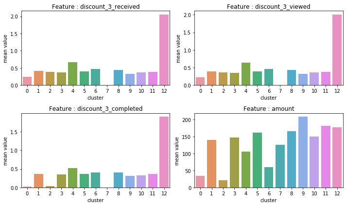

折扣4:
1. 群组7几乎没有收到折扣4推送。
2. 群组8接收，查看和完成折扣4推送比较高。
3. 群组0，2，完成折扣4推送比较低。

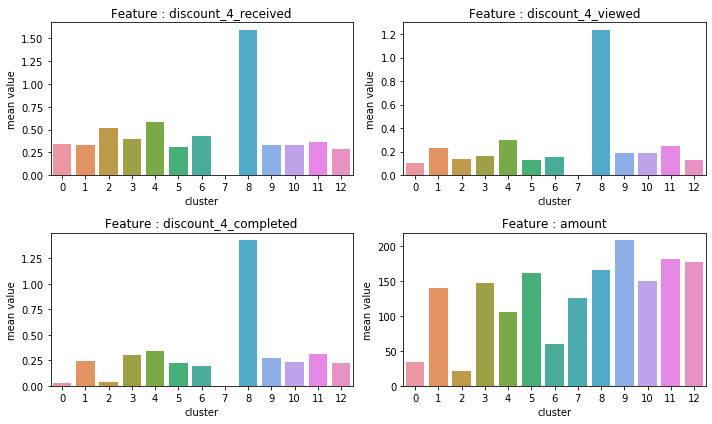

对折扣**推送建议**：

1. 向完成推送比较好的群组发送相应的推送。
    * 群组11完成折扣1推送最高。向群组11发送折扣1, 有效期为10天的消费20奖励5。
    * 群组10完成折扣2推送最高。向群组10发送折扣2, 有效期为7天的消费7奖励3。
    * 群组12完成折扣3推送最高。向群组12发送折扣3, 有效期为10天的消费10奖励2。
    * 群组8完成折扣4推送最高。向群组发送折扣4, 有效期为7天的消费10奖励2。
2. 向没有收到的群组推送：
    * 群组7是几乎没有收到折扣推送的一组。向群组7随机发送任何一种折扣。
3. 群组0和群组2，大约10%顾客完成折扣推送， 是完成折扣推送比率最低的组，说明此二组顾客对折扣推送没有兴趣。
    * 可以减少或停止向群组0和2发送任何一种折扣。

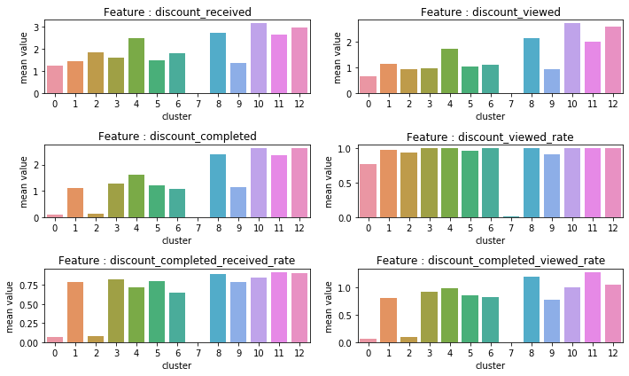

买一送一1:
1. 群组9完成买一送一1推送完成最多。
2. 群组4几乎没有收到买一送一1推送。

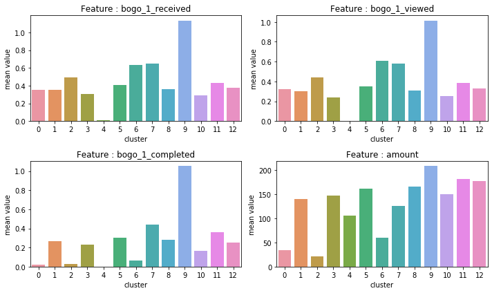

买一送一2:
1. 群组9完成买一送一2推送完成最多。
2. 群组4几乎没有收到买一送一2推送。

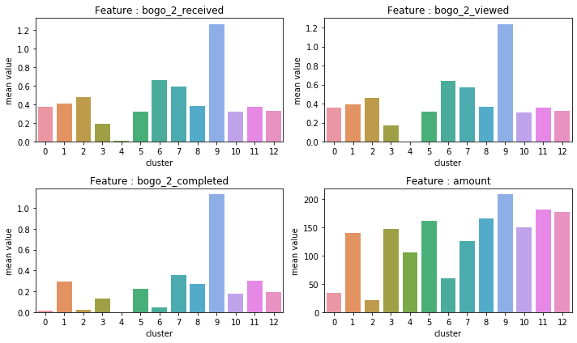

买一送一3:
1. 群组3完成买一送一3推送完成最多。
2. 群组4几乎没有收到买一送一3推送。

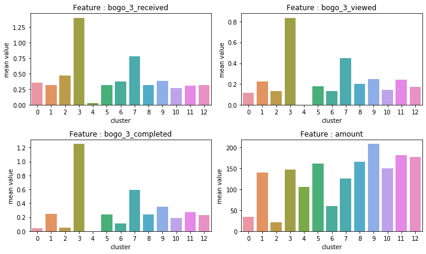

买一送一4:
1. 群组5完成买一送一4推送完成最多。
2. 群组4几乎没有收到买一送一4推送。

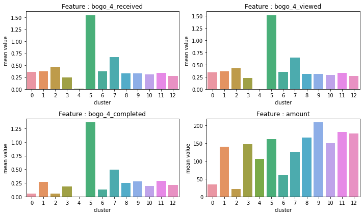

所以对买一送一的**推送建议**：

1. 向完成推送比较好的群组发送相应的推送。
    * 群组9完成买一送一1和2推送完成最多。向群组9发送买一送一1, 有效期为7天的消费10奖励10和买一送一2, 有效期为5天的消费10奖励10。
    * 群组3完成买一送一3推送完成最多。向群组3发送买一送一3, 有效期为7天的消费5奖励5。
    * 群组5完成买一送一4推送完成最多。向群组5发送买一送一4, 有效期为5天的消费5奖励5
    * 群组7完成4种买一送一推送次多。向群组7发送任一一种或多种买一送一推送。
2. 向没有收到的群组推送：
    * 群组4，是几乎没有收到买一送一的推送的一组，向群组4发送随机一种买一送一推送
3. 群组0，2，6接收并且查看了，但是完成比率较低。 说明此3组对买一送一推送响应度比较低。
    * 减少或停止向群组0，2和6发送买一送一的推送。

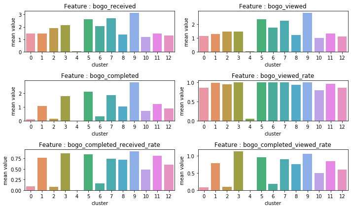

信息1:
第一类信息较多发送给群组1。
信息2:
第二类信息发送给群组0比较多，群组2几乎没有接收到次类信息推送。

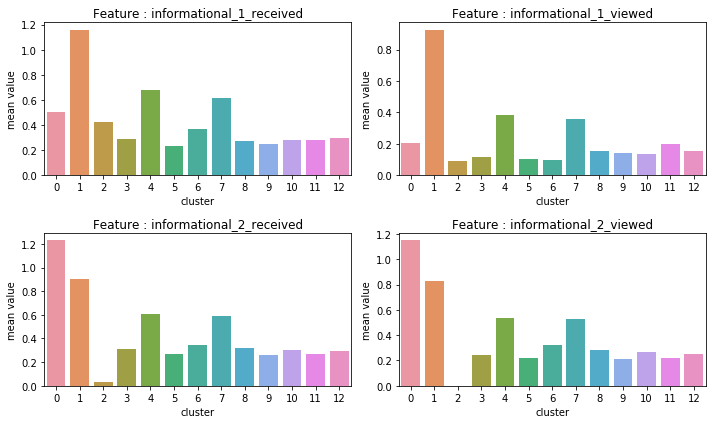

所以对信息的**推送建议**：

1. 向关注度高的群组发送：
    * 群组0和1接近100%的顾客查看了信息推送，向此2组发送信息类的推送。
    * 群组4，7，对信息推送的查看率接近于80%。也可向此群组继续发送。
2. 向收到比较少的群组发送：
    * 群组2几乎没有收到信息2，向群组2发送信息2, 有效期3天无奖励。

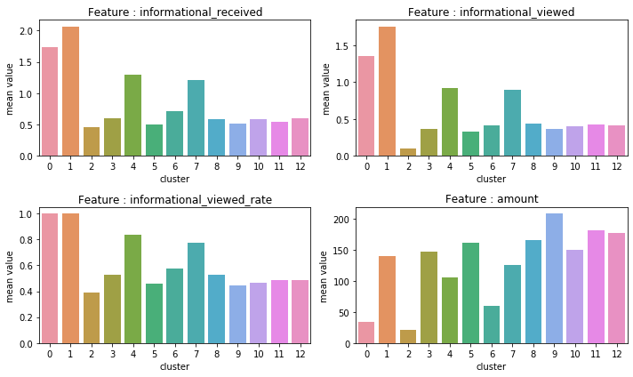

## 回顾与总结

1. Pandas Dataframe使用技巧在数据处理中有所提高。项目最具挑战的地方是如何进行有效的特征提取。现有的算法在处理顾客交易信息上花费的时间比较长，需要提高算法的效能，这是需要进一步完善的地方。

2. 深入了解了PCA和K-Means聚类结合来发现数据背后的真相。

3. 更好的理解聚类算法，加深对评价指标的了解。如何评价聚类的效果可以通过实验设计，A/B测试。具体可能是这样，顾客随机分两组，一组安原有的策略发送推送，另一组按聚类分析的结果进行干预，计算有效的样本大小，当满足样本大小时，终止实验。然后进行统计学检验。

## 感谢

感谢Udacity提供的精心设计的学习项目。谢谢。

## References
1. [Sklearn Cluster](https://scikit-learn.org/stable/modules/clustering.html) 

2. PULKIT SHARMA, [The Most Comprehensive Guide to K-Means Clustering You’ll Ever Need](https://www.analyticsvidhya.com/blog/2019/08/comprehensive-guide-k-means-clustering/#k-means-clustering-python-code)

3. [Silhouette](https://scikit-learn.org/stable/modules/generated/sklearn.metrics.silhouette_score.html)

4. [Jeffri Sandy](https://medium.com/@jeffrisandy/investigating-starbucks-customers-segmentation-using-unsupervised-machine-learning-10b2ac0cfd3b)

5. Minitab Blog Editor [Regression Analysis: How Do I Interpret R-squared and Assess the Goodness-of-Fit?](https://blog.minitab.com/blog/adventures-in-statistics-2/regression-analysis-how-do-i-interpret-r-squared-and-assess-the-goodness-of-fit)

